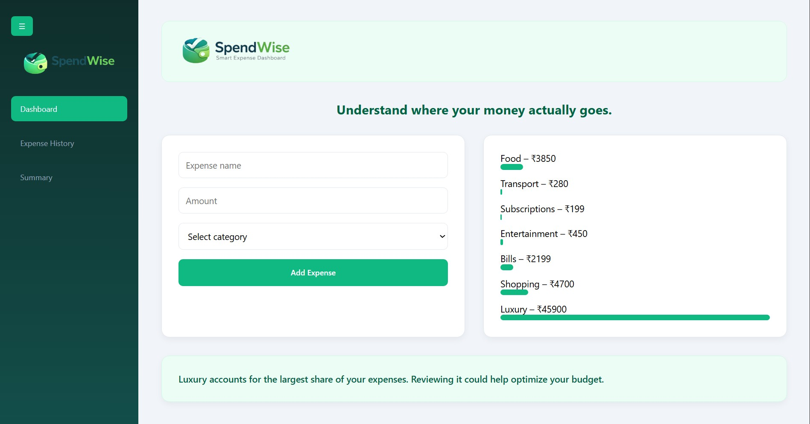
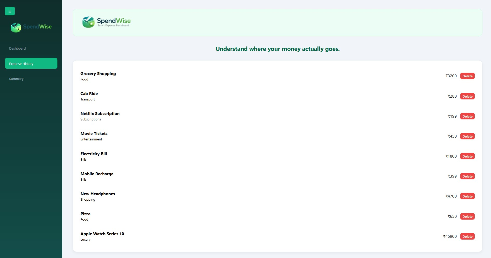
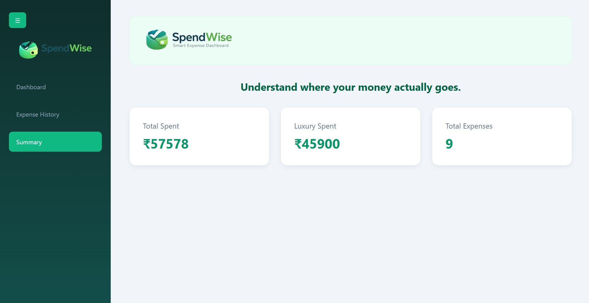

# SpendWise – Smart Expense Dashboard

## Overview

SpendWise is a web-based expense tracking application built using HTML, CSS, and Vanilla JavaScript.

It allows users to record daily expenses, view category-wise spending distribution, and receive simple spending insights in real time.

The goal of this project was to move beyond static pages and build a structured, data-driven interface using core JavaScript concepts without relying on frameworks.

---

## Project Preview

| Dashboard                                                       | Expense History                                                     | Summary & Insights                                                       |
| --------------------------------------------------------------- | ------------------------------------------------------------------- | ------------------------------------------------------------------------ |
|  |  |  |

> A quick overview of expense tracking, transaction history, and spending insights within SpendWise.

---

## Features

* Add expenses with input validation
* Delete individual expenses
* Data persistence using LocalStorage
* Dynamic category breakdown graph
* Automated spending insight logic
* Sidebar navigation with single-page behavior
* Financial summary view

  * Total Expenses
  * Luxury Spending
  * Total Transactions
* Responsive and structured layout

---

## Tech Stack

### Frontend

* HTML5
* CSS3 (Flexbox + Grid)
* Vanilla JavaScript

### Storage

* Browser LocalStorage API

---

## Data Flow & Architecture

The application uses a centralized `expenseList` array as the single source of truth.

Each expense is stored as an object containing a name, amount, and category.

Whenever an expense is added or deleted:

1. The application state is updated.
2. The `updateApp()` function is triggered.
3. All dependent UI sections are re-rendered.

This includes:

* Expense History
* Category Breakdown Graph
* Summary Calculations
* Spending Insights

This approach ensures the interface always reflects the latest data while keeping the logic predictable and maintainable.

No frameworks or external libraries were used. All UI updates are handled through manual DOM manipulation and array methods such as `reduce()`, `filter()`, and `forEach()`.

---

## Learning Outcomes

* Improved understanding of managing and updating application data
* Strengthened DOM manipulation skills
* Applied `reduce()`, `filter()`, and `forEach()` in practical use cases
* Implemented dynamic rendering without page reloads
* Learned to use LocalStorage for client-side persistence
* Practiced organizing JavaScript logic into reusable functions

---

## Key Takeaway

SpendWise was built to focus on fundamentals.

The project emphasizes clarity, structure, and the practical implementation of core JavaScript concepts through a real-world expense tracking application.
